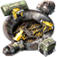

# Fairypelago

A discord bot for using discord channels as text clients for [Archipelago Multiworld](https://github.com/ArchipelagoMW/Archipelago).

## Supported Features

- **Forwarding and receiving player messages** through Discord
- Displaying network events with **item icons** for supported games
- Configurable **player icons** per server
- **Tracking of session state** through the network and webhost api
- **Detection of a room url** for supported webhosts to create a client thread


When a supported webhost room URL is detected, it will create a new thread which acts like a client for the AP session.

By default, *server commands* are prefixed with `.`, and *session commands* (AP-specific commands that can only be used in an active session room) are prefixed with `>`.

If __autojoin__ is enabled in guild settings, the bot will attempt to connect to the first slot in the player list as a "vessel", due to the limitation of clients must connecting through a player slot. Otherwise, it can be manually connected through the command `> connect <player slot name>`.

### Currently Supported Webhosts

- [archipelago.gg](https://archipelago.gg/)

### Currently Supported Game Icons

-  A Hat in Time
-  Another Crab's Treasure
- 🎱 APBingo
- 🔢 Archipeladoku
-  Celeste 64
-  Celeste (Open World)
-  Factorio / Factorio - Space Age Without Space
-  Hollow Knight
-  Kirby Super Star
-  Link's Awakening DX
-   Luigi's Mansion
-  Majora's Mask Recompiled
-  Mario & Luigi Superstar Saga
-  Metroid Fusion
-  Metroid Zero Mission
-  Minecraft
-  Minecraft Dig
-  Ocarina of Time
- 🖌️ Paint
-  PokePark
-  Pikmin 2
-  Risk of Rain 2
-  Ship of Harkinian
-   Super Mario 64
-   Super Mario Sunshine
-   Super Mario World
-   Super Metroid
-   Super Metroid Map Rando
-   SMZ3
- Terraria
-  Touhou Koumakyou ~ the Embodiment of Scarlet Devil
-  The Minish Cap
-  The Wind Waker
-  Undertale
- 🪙 Unfair Flips
-  Toontown
-  Paper Mario: The Thousand-Year Door
-  Wario Land 4
- 📝 Wordipelago
-  Yacht Dice

### Item Types

Item messages are prefixed with different colors:

 Progression
 Useful
 Filler
 Trap


## Running the Bot

First a `.env` file is required to set up global variables with the following fields:
```
# Retrieved from the Discord application portal
DISCORD_BOT_TOKEN=
# Your Discord account's snowflake id
OWNER_ID=
```

### Docker
The bot comes with a **Dockerfile** to easily start instances of the bot.
On a Docker installed system, you can start the bot in detached mode in the repo's root directory:
```
docker compose up --build -d
```

### Manual

To run the bot manually, Node.js (20.2.0+) must first be installed on the system.
```
# Install dependencies
npm i
# Run the bot
npm start
```

### Icons

Icons are located in the assets folder and should be uploaded to your bot through the developer application portal. Note that Discord has a **limit of 2,000 emojis** for an application, and while this limit has not been reached yet with the current icon list, if it ever does, you should pick and choose which games to upload icons for.

## Contributing

### Adding Icons

To add icons for a new game, you can use this [file generator](https://espaspw.github.io/ap-icon-matcher-generator/ ) to create the script file for the game.
Not all mappings need to be filled, and it is recommended to coalesce mappings using regex when appropriate.

- `/src/data/matchers`: Item name to emoji mapping
- `/src/data/icons.ts`: Exporting item icons and define mappings for game names

